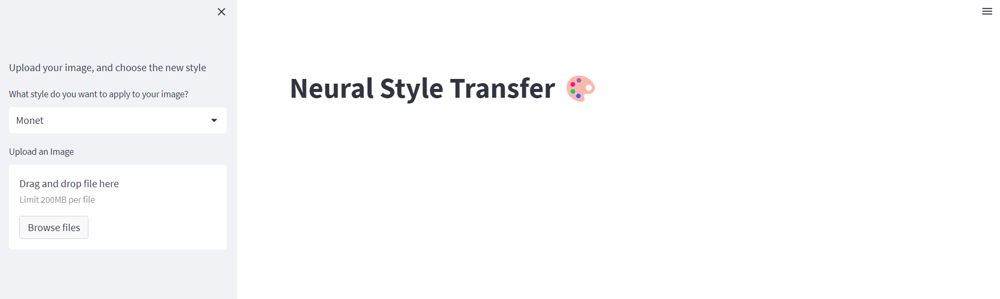
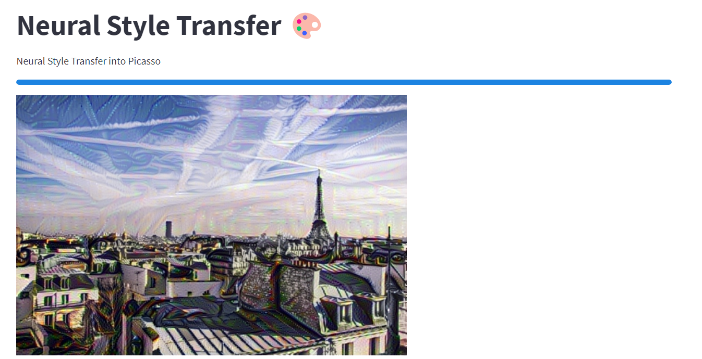

# Neural Style Transfer

This project aims to eplore "Neural Style Transfer" and how it can be implemented.

## Contents

The work is split into 2 parts:

- Notebook for Proof of Concept
- Web app and api for a hosted NST app

### Notebook

The [notebook](notebooks/Neural%20Style%20Transfer.ipynb) contains all the necessary information to understand the workings of NST and implementation details using VGG19 neural network.

### Demo

The [web app](web/) and [api](api/) are a demo of NST, where the api implemented in Fastapi returns a stream of 100 succesive images showing the progress of the NST, and the streamlit web interface consumes the stream and shows the progess.

#### Usage

The demo is accesible from the web app.

The welcome page gives the user the ability to upload an image of their choice, and choosing one of the available styles, to do the Neural Style Transfer.

The weclome page:



Input Image:


Style Image:


Around halfway through NST:


NST after 100 iterations:



After just 100 iterations, we notice the style of the image starting to change, and get more and more like that of the style reference image.

To run the demo, you have to follow these steps:

##### Web app

Run the following commands:

- Create and activate the conda environment:
  ```
  conda create --name nst-streamlit
  conda activate nst-streamlit
  ```
- Install the required dependencies:

  ```
  pip install -r web/requirements.txt
  ```

- Run the web app
  ```
  streamlit run "web/Neural Style Transfer 🎨.py"
  ```
- The web app will be available under `http://localhost:8501`

##### API

Run the following commands:

- Create and activate the conda environment:
  ```
  conda create --name nst-api
  conda activate nst-api
  ```
- Install the required dependencies:

  ```
  pip install -r api/requirements.txt
  ```

- Start the api
  ```
  uvicorn api.main:app --host 0.0.0.0 --port 8000
  ```
- The api will be available under `http://localhost:8000`
